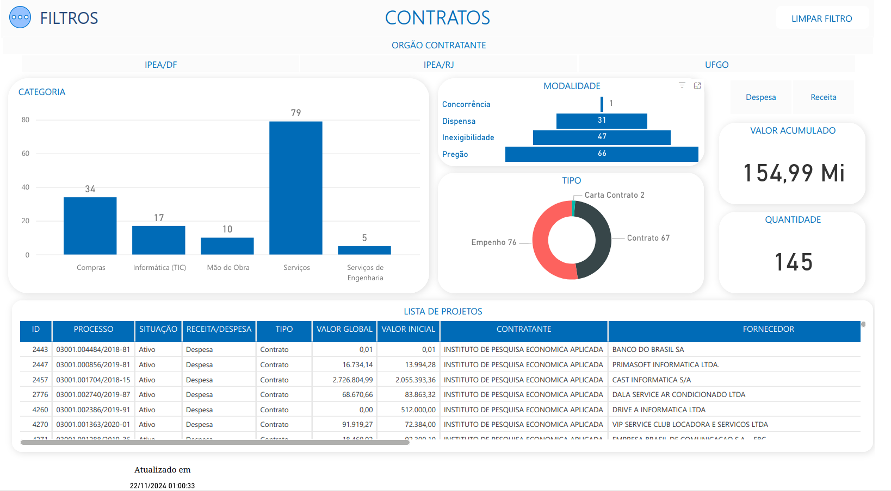

# Teste Avaliativo 
Teste Avaliativo para Vaga de Estagiário em Engenharia/Análise de Dados

## Descrição do Código

O notebook está estruturado em etapas lógicas:  

1. **Carregamento e Tratamento dos Dados**  
   - Leitura do arquivo de contratos.  
   - Tratamento de valores ausentes e conversões.  

2. **Cálculo de Métricas Estatísticas**  
   - **Médias**: Valores iniciais, valores globais, tempo de vigência e valores por parcela.
   - **Mediana**: Determinação para o valor global. 
   - **Desvios-padrão**: Para analisar a dispersão das métricas mencionadas.   
   - Estatísticas descritivas para identificar tendências e extremos.  

4. **Identificação de Contratos Inconsistentes**  
   - Detecção de contratos com valor inicial maior que o valor global.  
   - Verificação de valores negativos ou tempos de vigência inválidos.  

5. **Resultados**  
   - Os resultados são consolidados em tabelas e gráficos interativos, além de um dashboard.  

---

## **Resultados da Análise**  

### 1. **Médias**  
- **Valor inicial**: **R$ 421.564,93**  
- **Valor global**: **R$ 420.052,33**  
- **Valor médio por parcela**: **R$ 112.187,32**  
- **Tempo médio de vigência**: **653,92 dias**

### 2. **Mediana do valor global**  
- **R$ 9.108,00**  

### 3. **Desvios-padrão**  
- **Valor inicial**: **R$ 1.086.641,00**  
- **Valor global**: **R$ 1.134.208,19**  
- **Tempo de vigência**: **664,58 dias**  

### 4. **Categorias**  
- **Média do valor global por categoria**:  
  - Compras: **R$ 87.236,29**  
  - Mão de obra: **R$ 2.804.520,10**  
  - Serviços de Engenharia: **R$ 1.154.703,99**  
- **Quantidade de contratos por categoria**:  
  - Serviços: **81 contratos** (a maior quantidade)  
  - Serviços de Engenharia: **5 contratos** (a menor quantidade)

### 5. **Estatísticas descritivas**  
- **Valores globais**:  
  - Variam de **R$ 0,00** a **R$ 6.398.761,49**  
  - 75% dos contratos estão abaixo de **R$ 144.257,72**  
- **Tempo de vigência**:  
  - Variam de **10 dias** a **10 anos (3.653 dias)**

### 6. **Valores ausentes**  
- Colunas com valores ausentes incluem:  
  - `subtipo`  
  - `justificativa_inativo`  
  - `sistema_origem_licitacao`  

### 7. **Contratos inconsistentes**  
- **Contratos com valor inicial maior que o valor global**: **14 contratos**.  
  - Esses contratos podem exigir uma revisão mais detalhada.  
- Não foram encontrados valores negativos ou tempos de vigência negativos.  

---

## Dashboard 

